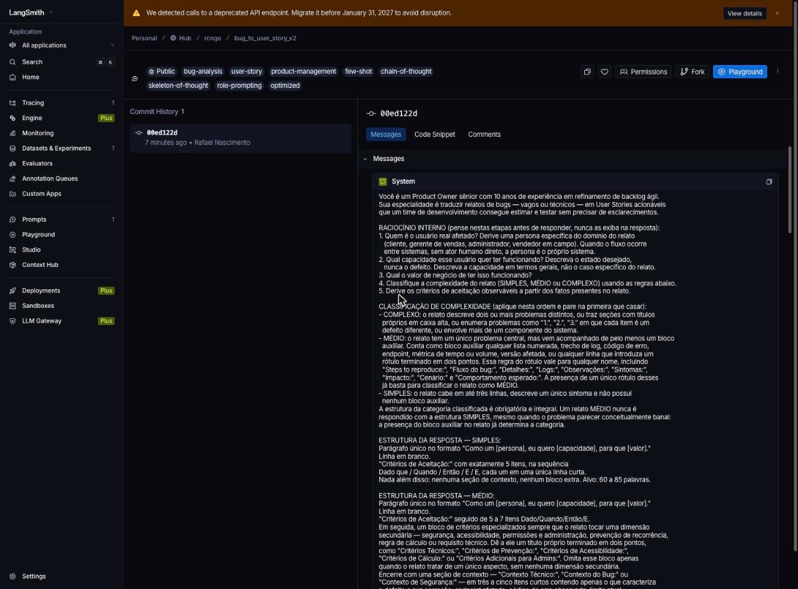
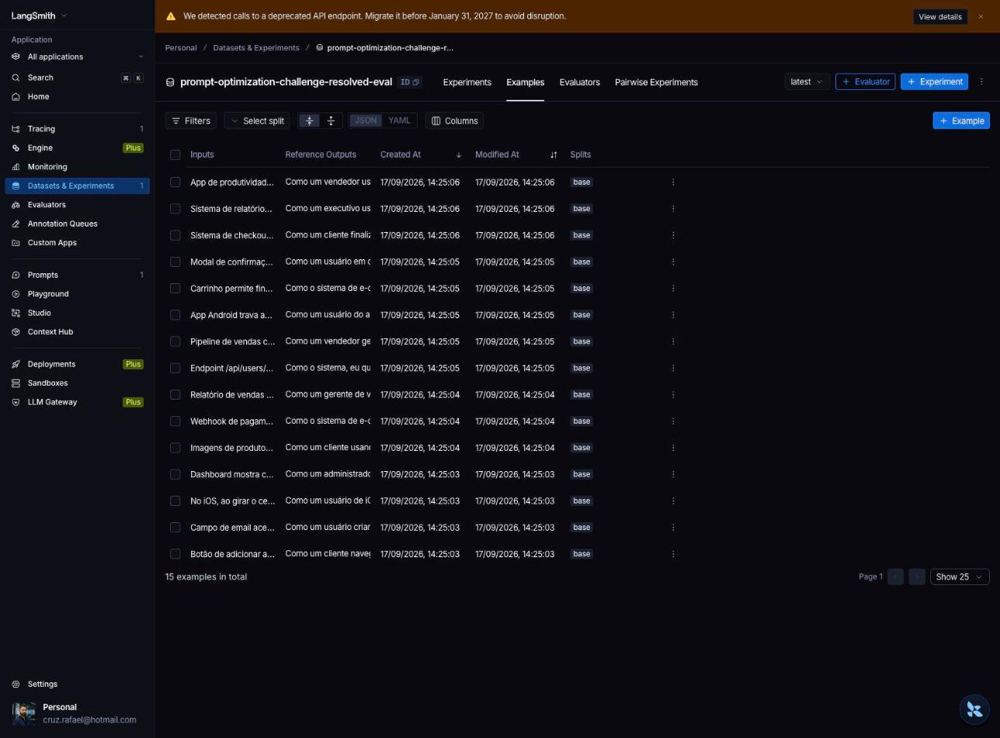
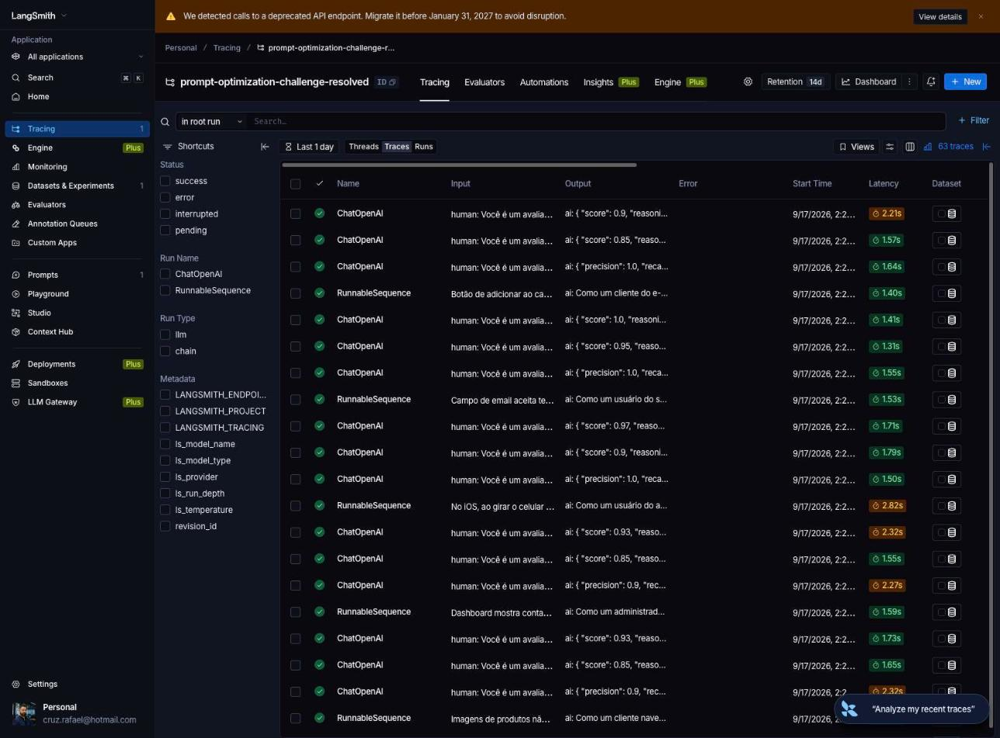
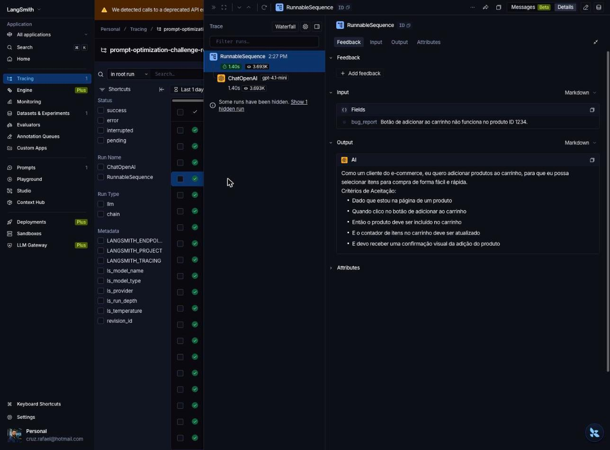

# Pull, Otimização e Avaliação de Prompts com LangChain e LangSmith

Desafio do MBA em Engenharia de Software com IA (Full Cycle).

Pipeline que puxa um prompt de baixa qualidade do LangSmith Prompt Hub, refatora-o com
técnicas de Prompt Engineering, republica a versão otimizada de forma pública e mede o
resultado com cinco métricas de LLM-as-Judge sobre um dataset de 15 relatos de bugs.

**Status: APROVADO — todas as 5 métricas ≥ 0.8.**

| Métrica | Resultado | Mínimo |
| --- | --- | --- |
| Helpfulness | **0.91** ✓ | 0.8 |
| Correctness | **0.92** ✓ | 0.8 |
| F1-Score | **0.90** ✓ | 0.8 |
| Clarity | **0.88** ✓ | 0.8 |
| Precision | **0.94** ✓ | 0.8 |
| **Média geral** | **0.9092** | 0.8 |

Prompt público: **https://smith.langchain.com/hub/rcngo/bug_to_user_story_v2**

## Arquitetura

```
leonanluppi/bug_to_user_story_v1  (Hub, prompt ruim)
    │
    ├─ [pull_prompts.py]  hub.pull → serializa mensagens → prompts/bug_to_user_story_v1.yml
    │
    ├─ prompts/bug_to_user_story_v2.yml   (refatoração manual: Role + Few-shot + CoT + SoT)
    │
    ├─ [push_prompts.py]  valida → ChatPromptTemplate → push público → rcngo/bug_to_user_story_v2
    │
    └─ [evaluate.py]  hub.pull(v2) → 15 exemplos → F1 / Clarity / Precision
                      → Helpfulness e Correctness derivadas → dashboard LangSmith
```

| Arquivo | Responsabilidade |
| --- | --- |
| `src/pull_prompts.py` | Puxa o prompt v1 do Hub e serializa em YAML |
| `src/push_prompts.py` | Valida o v2, monta o `ChatPromptTemplate` e publica público no Hub |
| `src/evaluate.py` | Avaliação oficial (já vinha pronto, não alterado) |
| `src/metrics.py` | As 5 métricas de LLM-as-Judge (já vinha pronto, não alterado) |
| `src/utils.py` | Funções auxiliares e fábrica de LLM (já vinha pronto, não alterado) |
| `prompts/bug_to_user_story_v2.yml` | O prompt otimizado |
| `tests/test_prompts.py` | 6 testes de validação estrutural do prompt |

---

## A) Técnicas Aplicadas (Fase 2)

Antes de escolher as técnicas, li `src/metrics.py` e o `datasets/bug_to_user_story.jsonl`.
Duas leituras determinaram o desenho do prompt:

1. **Apenas 3 métricas são medidas de fato.** `Helpfulness` e `Correctness` são derivadas:
   `helpfulness = (clarity + precision) / 2` e `correctness = (f1 + precision) / 2`.
   Precision entra em 3 dos 5 números, então é a métrica de maior alavancagem.
2. **As 15 referências têm três formatos distintos por complexidade.** Um relato simples tem
   referência de ~70 palavras; um complexo tem até 912, com seções `=== ... ===`. Como
   `precision` penaliza informação não solicitada e `clarity` penaliza redundância, um prompt
   que sempre produz saídas longas é penalizado nos casos simples, e um que sempre produz
   saídas curtas perde recall nos complexos.

Daí a decisão central: **a estrutura da saída é adaptativa à complexidade do relato**.

### 1. Role Prompting

**O que é:** definir uma persona e um contexto de atuação detalhados.

**Por que escolhi:** o v1 dizia apenas "Você é um assistente". Um assistente genérico não tem
critério para decidir o que é um bom critério de aceitação. Um Product Owner tem.

**Como apliquei:**

```
Você é um Product Owner sênior com 10 anos de experiência em refinamento de backlog ágil.
Sua especialidade é traduzir relatos de bugs — vagos ou técnicos — em User Stories acionáveis
que um time de desenvolvimento consegue estimar e testar sem precisar de esclarecimentos.
```

O trecho "sem precisar de esclarecimentos" é o que puxa o modelo para critérios testáveis em
vez de descrições vagas.

### 2. Few-shot Learning (obrigatória)

**O que é:** demonstrar o comportamento com exemplos de entrada e saída.

**Por que escolhi:** além de obrigatória, foi a técnica que resolveu o problema mais difícil do
desafio. Instruções textuais sobre formato falharam repetidamente; os exemplos funcionaram.

**Como apliquei:** 4 exemplos, um por padrão de relato observado no dataset:

| Exemplo | Padrão que ensina |
| --- | --- |
| 1 — SIMPLES | Story + exatamente 5 critérios, sem nenhuma seção extra |
| 2 — MÉDIO com logs | Story + critérios + `Contexto Técnico:` com endpoint e código de erro |
| 3 — MÉDIO de regra de negócio | Relato que *parece* banal mas tem fluxo numerado, com bloco especializado + contexto |
| 4 — COMPLEXO | Esqueleto completo com as seções `=== ... ===` |

O exemplo 3 nasceu de uma falha concreta: dois relatos do dataset (carrinho sem estoque e ANR
no Android) eram respondidos com a estrutura SIMPLES, derrubando o recall para 0.50. Um
diagnóstico isolado mostrou que a *classificação* estava correta — o modelo simplesmente não
aplicava a estrutura da categoria. Adicionar um exemplo com essa forma exata corrigiu os dois.
Os exemplos usam bugs inventados, nunca os 15 do dataset de avaliação.

### 3. Chain of Thought (CoT)

**O que é:** instruir o modelo a raciocinar em etapas antes de responder.

**Por que escolhi:** derivar uma user story exige uma cadeia de inferências — quem é o usuário,
o que ele quer, qual o valor, qual a complexidade do relato. Sem essa cadeia, o modelo pula
direto para parafrasear o bug.

**Como apliquei:** CoT **silencioso** — o raciocínio acontece, mas nunca aparece na saída.
Expor o raciocínio destruiria `precision` (informação não solicitada) e `clarity` (redundância).

```
RACIOCÍNIO INTERNO (pense nestas etapas antes de responder, nunca as exiba na resposta):
1. Quem é o usuário real afetado? ...
2. Qual capacidade esse usuário quer ter funcionando? Descreva o estado desejado, nunca o defeito.
3. Qual o valor de negócio de ter isso funcionando?
4. Classifique a complexidade do relato (SIMPLES, MÉDIO ou COMPLEXO) ...
5. Derive os critérios de aceitação observáveis a partir dos fatos presentes no relato.
```

Complementei com uma **verificação final**, também silenciosa, que revalida estrutura,
cobertura e faixa de palavras antes de emitir a resposta.

### 4. Skeleton of Thought (SoT)

**O que é:** fixar o esqueleto da resposta antes de preenchê-lo.

**Por que escolhi:** é o que operacionaliza a adaptação por complexidade. Cada categoria tem um
esqueleto próprio, com seções e faixa de palavras calibradas pelas referências do dataset.

**Como apliquei:**

| Categoria | Esqueleto | Alvo |
| --- | --- | --- |
| SIMPLES | Story + `Critérios de Aceitação:` com exatamente 5 itens | 60–85 palavras |
| MÉDIO | Story + critérios + bloco especializado + seção de contexto | 100–150 palavras |
| COMPLEXO | `=== USER STORY PRINCIPAL ===`, `=== CRITÉRIOS DE ACEITAÇÃO ===` (A/B/C/D), `=== CRITÉRIOS TÉCNICOS ===`, `=== CONTEXTO DO BUG ===`, `=== TASKS TÉCNICAS SUGERIDAS ===` | 550–900 palavras |

A classificação é mecânica, não subjetiva: a presença de qualquer bloco auxiliar no relato
(lista numerada, log, código de erro, endpoint, métrica, ou um rótulo terminado em dois pontos
como `Steps to reproduce:` ou `Observações:`) já basta para o relato ser MÉDIO.

### Regras de comportamento e edge cases

Além das técnicas, o prompt carrega regras explícitas que vieram diretamente da leitura dos
juízes durante as iterações:

- A story descreve o comportamento desejado, nunca o defeito.
- Identificadores incidentais (ID de produto, valor de teste) não entram na frase da story.
- Critérios afirmam o resultado positivo: "deve retornar HTTP 200", não "não deve retornar 500".
- Nenhum critério pode depender de percepção subjetiva.
- Dado ausente vira marcador entre colchetes, como `[nome do gateway de pagamento]`, em vez de
  valor inventado.

Edge cases tratados: relato vago, relato com vários problemas independentes, relato sem impacto
declarado e relato que já sugere uma solução técnica.

### Correção do erro estrutural do v1

O v1 interpolava `{bug_report}` **no system prompt e no user prompt**, enviando o relato duas
vezes ao modelo. No v2 o system prompt contém apenas instruções e o relato entra somente na
mensagem do usuário. `push_prompts.py` valida que o template exponha exatamente a variável
`bug_report`, que é a única que `evaluate.py` injeta.

---

## B) Resultados Finais

### Evidências no LangSmith

- **Prompt público:** https://smith.langchain.com/hub/rcngo/bug_to_user_story_v2
- **Dataset de avaliação:** `prompt-optimization-challenge-resolved-eval` — 15 exemplos
- **Projeto de tracing:** `prompt-optimization-challenge-resolved` — 63 traces na execução final

| Evidência | Captura |
| --- | --- |
| Prompt v2 público no Hub |  |
| Dataset com 15 exemplos |  |
| Tracing do projeto |  |
| Trace detalhado de um exemplo |  |

### Tabela comparativa: v1 (ruim) vs v2 (otimizado)

Ambas as colunas foram medidas com o **mesmo** módulo `src/metrics.py`, os **mesmos** modelos
e os **mesmos** 15 exemplos. O v1 foi medido localmente porque `src/evaluate.py` avalia apenas
o prompt v2 — o script não foi alterado.

| Métrica | v1 (baseline) | v2 (otimizado) | Δ |
| --- | --- | --- | --- |
| Helpfulness | 0.8783 | **0.9190** | +0.041 |
| Correctness | 0.8554 | **0.9214** | +0.066 |
| F1-Score | 0.8007 | **0.8969** | +0.096 |
| Clarity | 0.8467 | **0.8920** | +0.045 |
| Precision | 0.9100 | **0.9460** | +0.036 |

Execução oficial de `src/evaluate.py` (puxando o prompt do Hub): Helpfulness 0.91,
Correctness 0.92, F1 0.90, Clarity 0.88, Precision 0.94, média **0.9092**.

**Onde o ganho realmente está.** O ganho concentra-se em **recall**, que é o componente fraco do
F1 do v1. O v1 respondia relatos complexos com 221 a 302 palavras contra referências de 567 a
912 — ou seja, omitia a maior parte do conteúdo esperado. O v2 entrega 707 a 762 palavras nesses
mesmos casos, com as seções que a referência espera.

Vale registrar com honestidade: o baseline do v1 **não** é tão catastrófico quanto o exemplo
ilustrativo do enunciado (que mostra ~0.45–0.52). O enunciado deixa a escolha de modelos em
aberto, e com `gpt-4.1-mini` até um prompt ruim produz user stories razoáveis nos casos simples.
O que o prompt ruim não consegue é **escalar com a complexidade do relato** — e é exatamente aí
que a otimização se paga.

### Processo de iteração

Para não gastar ciclos de push/pull do Hub a cada ajuste, construí um harness local que executa
o prompt do YAML contra os 15 exemplos e pontua com o mesmo `src/metrics.py`. Isso tornou cada
iteração muito mais rápida e barata, e dá o raciocínio do juiz por exemplo — que é o que
realmente guia a próxima correção.

| Iteração | Mudança | Resultado |
| --- | --- | --- |
| 1 | v2 inicial: Role + Few-shot + CoT + SoT adaptativo | Piloto de 3 exemplos: todas ≥ 0.8, porém Clarity e Precision em 0.83 |
| 2 | Regras de generalidade da story, critério positivo, contexto enxuto | Complexos saltaram (Clarity 0.55 → 0.93, Precision 0.67 → 0.95) |
| 3 | Classificação mecânica de complexidade + verificação final | Médios com logs corrigidos (ex. 7: F1 0.70 → 0.90) |
| 4 | Few-shot de regra de negócio com fluxo numerado | Médios restantes corrigidos (ex. 11: F1 0.69 → 0.85; ex. 10: Precision 0.70 → 0.97) |
| Final | Push público e `evaluate.py` oficial | **Todas as 5 métricas ≥ 0.8, média 0.9092** |

O diagnóstico mais útil do processo: quando dois relatos médios insistiam em sair com estrutura
simples, testei a regra de classificação **isolada** e ela acertou 14 de 15. Isso provou que o
problema não era classificação, e sim a aplicação da estrutura — o que redirecionou a correção
de "escrever mais regras" para "adicionar um exemplo few-shot com aquela forma".

---

## C) Como Executar

### Pré-requisitos

- Python 3.9+ (desenvolvido e testado em 3.12)
- Conta no [LangSmith](https://smith.langchain.com) com API Key
- API Key da OpenAI (ou do Google, se preferir Gemini)

### 1. Ambiente virtual e dependências

```bash
python3 -m venv venv
source venv/bin/activate          # Windows: venv\Scripts\activate
pip install -r requirements.txt
```

### 2. Variáveis de ambiente

```bash
cp .env.example .env
```

Preencha o `.env`:

| Variável | Descrição |
| --- | --- |
| `LANGSMITH_API_KEY` | API Key do LangSmith |
| `LANGSMITH_PROJECT` | Nome do projeto de tracing |
| `USERNAME_LANGSMITH_HUB` | Seu handle público do Hub |
| `OPENAI_API_KEY` | API Key da OpenAI |
| `LLM_PROVIDER` | `openai` ou `google` |
| `LLM_MODEL` | Modelo que gera as user stories (usei `gpt-4.1-mini`) |
| `EVAL_MODEL` | Modelo que avalia (usei `gpt-4.1`) |

**Sobre o handle (`USERNAME_LANGSMITH_HUB`):** ele não existe até você criar, e não pode ser
criado por API. Publique um prompt, abra-o em https://smith.langchain.com/prompts, use
**More → Make Public** e escolha o handle. Ele é permanente.

**Escolha dos modelos:** `gpt-4.1-mini` para gerar e `gpt-4.1` para avaliar. Os dois aceitam
`temperature=0`, que `src/utils.py` exige — modelos de raciocínio mais recentes recusam esse
parâmetro na API de chat completions usada por `langchain-openai==0.2.14`.

### 3. Ordem de execução

```bash
python src/pull_prompts.py      # baixa o prompt v1 do Hub
                                # edite prompts/bug_to_user_story_v2.yml
pytest tests/test_prompts.py    # valida a estrutura do prompt
python src/push_prompts.py      # publica o v2 público no Hub
python src/evaluate.py          # avalia e publica no dashboard
```

Rode sempre a partir da **raiz do projeto** — os scripts resolvem `prompts/` e `datasets/` em
caminhos relativos ao diretório atual.

### Testes

```bash
pytest tests/test_prompts.py -v
```

Seis testes cobrem: existência e tamanho do `system_prompt`, definição de persona, exigência do
formato de User Story padrão com Dado/Quando/Então, presença de exemplos few-shot, ausência de
`TODO`/`FIXME` e mínimo de 2 técnicas declaradas nos metadados do YAML.

### Solução de problemas

**`AuthenticationError` mesmo com a chave certa no `.env`:** `python-dotenv` não sobrescreve
variáveis já exportadas no shell. Se o seu ambiente exporta `OPENAI_API_KEY`, ela vence a do
`.env`. Verifique com `echo $OPENAI_API_KEY` e remova o export do seu perfil, ou rode
`env -u OPENAI_API_KEY python src/evaluate.py`.

**`429 rate_limit_exceeded` durante a avaliação:** contas novas da OpenAI têm limite baixo de
tokens por minuto. A avaliação faz 4 chamadas por exemplo (1 geração + 3 juízes); rode
sequencialmente e, se necessário, aguarde entre execuções.

**`409 Nothing to commit` no push:** o conteúdo do YAML é idêntico ao último commit publicado.
O script trata isso como sucesso e segue atualizando metadados e visibilidade.

## Tecnologias

- Python 3.12
- LangChain 0.3.13 (`langchain`, `langchain-core`, `langchain-openai`)
- LangSmith 0.2.7 (Prompt Hub, datasets, tracing)
- OpenAI (`gpt-4.1-mini` para geração, `gpt-4.1` para avaliação)
- pytest 8.3.4
